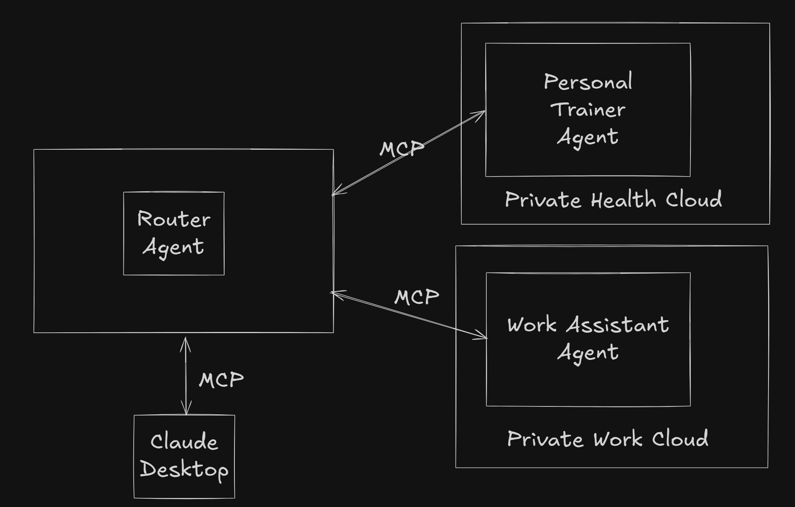

# MCP Multi-Agent Modular Awesomeness!



## Overview

This is a primative multi-agent modular initialization capability test prototype of Model Context Protocol.  My test project will have multiple servers and clients.  They will operate in a modular way, the first will create a markdown file based on adding user input text to a content template and saving the file to root directory.  The second will ingest that file and add more info to it then save the updated version to the root.  The alt A third will likewise ingest the output of the second and add still more content and export the third version of the file to the root.  The alt B third server alternatively could take another action.  Treat each of these three like back boxes in the sense that they will not share code or components but we will pretend they are running on different technologies to preserve the modular approach and we will for convenience be able to do things like share a virtual environment and requirements for this first test.  The second server will be a decider and will choose which is the best next server.

The notion of strict modularity such that different MCP interoperable system could be created and operated by totally different teams or even different companies is potentially a key unlock for MCP and for LLM based agents to take off and be scalable and more fully userful.  This is described more fully in the project overview for "Agent" here: [https://github.com/dazzaji/mcp-project/issues/1](https://github.com/dazzaji/mcp-project/issues/1). 

# Let's Run the Project!

(Based on continuing periodic issues, I've further documented below how best to run and use this project based on the various obstacles that have popped up.  Note that the file paths should be updated to your machine and I hard-coded the version of Python I'm using to deal with countless issues pointing to the right version and maintaining the link to it.)

Okay, let's get the `mcp-agent-router` project running with Claude Desktop and the MCP Inspector. Here's a step-by-step guide that addresses your specific concerns, using `uv` as requested and focusing on understanding how to integrate Claude Desktop and use the Inspector for troubleshooting.

**1. Project Setup with `uv`**

First, ensure your project environment is correctly set up with `uv`.

   ```bash
   # Clone the repository if you haven't already
   git clone <repository-url>
   cd mcp-agent-router

   # Remove existing virtual environments if any
   rm -rf .venv venv

   # Create a new virtual environment with Python 3.11
   /Library/Frameworks/Python.framework/Versions/3.11/bin/python3.11 -m venv ./venv
  
   # Link venv to .venv for uv
   ln -s venv .venv
  
   # Activate the virtual environment
   source ./venv/bin/activate
  
   # Confirm Python version
   python --version
   # Expected output is: Python 3.11.x
  
   # Install necessary dependencies using uv
   uv pip install flask anthropic requests python-dotenv mcp
  
   # Update the python version
   echo "3.11" > .python-version
   ```
   
   **Explanation:**
   *   We're creating the virtual environment using Python 3.11, which you specified in the `.python-version` file.
   *   The symbolic link `ln -s venv .venv` is used to make `uv` correctly recognize the virtual environment.
   *   `uv pip install` installs required packages.

**2. Start the MCP Servers and Gateway Agent**

Next, we'll start each of your three "black box" servers and the gateway agent in separate terminals.

   **Terminal 1: Server A (Personal Trainer)**
   ```bash
   cd server-a
   source ../venv/bin/activate
   python server.py
   ```

   **Terminal 2: Server B (Work Assistant)**
   ```bash
   cd ../server-b
   source ../venv/bin/activate
   python server.py
   ```

   **Terminal 3: Gateway Agent**
   ```bash
   cd ../gateway-agent
   source ../venv/bin/activate
    uv run service.py
   ```

   **Explanation:**
   *   Each server and the gateway agent are started in their respective directories within your project.
   *   We use `source ../venv/bin/activate` to ensure each uses the same virtual environment.
   *   This step assumes that servers A and B have a `server.py` file with basic MCP server implementation. It also assumes the `gateway-agent` has a `service.py` file to run with `uv`.

**3. Configure Claude Desktop**

Now, let's configure Claude Desktop to recognize your gateway agent and servers. Here’s how your `claude_desktop_config.json` should be structured, assuming `server-a`, `server-b`, and the `gateway-agent` are on ports 5010, 5001 and 8000 respectively:

   ```json
   {
      "mcpServers": {
         "gateway-agent": {
            "url": "http://localhost:8000/mcp/v1"
         },
         "server-a": {
           "url": "http://localhost:5010/mcp/v1"
         },
         "server-b": {
            "url": "http://localhost:5001/mcp/v1"
         }
      }
   }
   ```

   **Explanation:**
   *   Locate the `claude_desktop_config.json` file in your system (its path can vary depending on your OS). Refer to the MCP docs for OS specific location of the file.
   *   The `mcpServers` object now contains configurations for each server, including the `gateway-agent`, `server-a` and `server-b`.. Make sure these URL paths match the actual endpoints you have set up in the corresponding `server.py` files.
    *   The gateway is explicitly using http (not https) protocol for the Inspector and Claude integration.
   *   **Restart Claude Desktop** after updating this file for the changes to take effect.

**4. Starting and Using the MCP Inspector**

Now we can run and use the inspector to test out the servers and debug.

   **Open a new terminal (Terminal 4):**
   ```bash
   cd mcp-agent-router/gateway-agent
   source ../venv/bin/activate
   npx @modelcontextprotocol/inspector http://localhost:8000/mcp/v1
   ```

   **Explanation:**
    * We open a *new* terminal in `mcp-agent-router/gateway-agent` directory.
    *   We activate the same environment as for the gateway server.
   *   The command starts the MCP Inspector and attempts to connect directly to your gateway agent's HTTP endpoint. The inspector UI will open in your default browser.

**5. Interacting with MCP Inspector**

*   **Verify connection:**
   * Once the Inspector UI loads, you will see three fields for Command, Arguments and Environment Variables. If the client was able to connect to the server, the box with the server name (e.g. gateway-agent) will show **connected**. If it fails to connect, it will say 'failed'. You may need to click the Format button in the 'Commands' section to get the servers to connect.
*   **Examine available tools:**
    *   Click on the **Tools** tab to see tools your gateway agent offers (e.g., `route_task`). If the connection is made successfully, you will see that a tool called `route_task` is now available in the inspector.
*   **Test routing:**
    *   Use the Inspector to call the `route_task` tool with various `user_input` queries. For example:
        *   `{"user_input": "How much should I weigh?"}` (should go to server A)
        *   `{"user_input": "What is my next project deadline?"}` (should go to server B)
    *   Observe the responses and check terminal output for which server was called. You can also look in your server log files in the `/shared` directory.
*   **Examine all communication**: You can see all communication between the Client and the server as it happens, including JSON messages that the client is sending to the server and what the server is sending back to the client. 
   
   **Explanation:**
   *   The MCP Inspector UI lets you interact with the server and inspect the messages sent and received.
   *   By using Inspector to test the routing, you can verify that the `route_task` tool is functioning correctly as you have described it.

**6. Interacting with Claude Desktop**

After completing these steps, Claude Desktop should be able to send queries through your gateway server.

   **To test with Claude Desktop:**
*  **Ensure you've restarted Claude Desktop** after changing `claude_desktop_config.json`.
* In Claude Desktop, try entering prompts that correspond to tools provided by your servers:
     *  For example, if you have configured a tool on `server-a` to get health information, entering "how much should I weigh?" should be routed to `server-a`. The response should come through your `gateway-agent`, then to Claude Desktop, and be displayed.
    *  Similarly, a query like "what are my deadlines this week" should go to `server-b`
    *   The response from the servers will be displayed in Claude's conversation history.

**Troubleshooting:**

*   **If `uv` is using wrong Python Version:** Follow the tips in the "cheat-sheet" you provided, specifically ensuring the `.venv` link is correct, and that the `VIRTUAL_ENV` variable is set correctly, and that VS code is picking the correct virtual environment.
*   **If `mcp` module is not found:** Again, as in your "cheat sheet" check if the `mcp` module is installed using `pip list | grep mcp`. Reinstall it using `pip install mcp` if necessary.
*   **If Servers or Gateway fail to Start**:
    *   Look at console logs for error messages in each terminal.
    *   Check that all dependencies are installed in the active virtual environments.
    *   Manually run each failing script in its own terminal with `python /path/to/script.py` to isolate issues.

**Key Points to Understand**

*   **Virtual Environments are Crucial**: Make sure each terminal uses the virtual environment created, as described in **Step 2**.
*   **Port and URL Consistency**:  Ensure the port numbers in your `claude_desktop_config.json` match the actual ports your servers are running on and that the URL paths `/mcp/v1` are consistent for each server.
*   **`uv` for Package Management**: This guide uses `uv` for dependency and server execution as you specified, be sure to use that in all cases for maximum compatibility.
*   **Inspector for Visibility:** The MCP Inspector is very useful for examining the messages being sent and received, this can help you pinpoint issues in routing, or data handling. Be sure to use the Inspector UI as described in **Step 5.**
*   **Claude for Testing:** Claude Desktop's MCP support allows for real-world end-to-end testing of the various tools you are creating, using the client as you would in a user scenario.
*   **Logging:** Ensure that your server and gateway agent implementations use Python’s `logging` module, outputting to `stderr` so you can check logs for errors and information in the terminal.

Note: Be sure to check the log files that are output into the shared folder for debugging. Also use the Inspector to make sure that you have each server connecting and correctly routing messages as designed. 